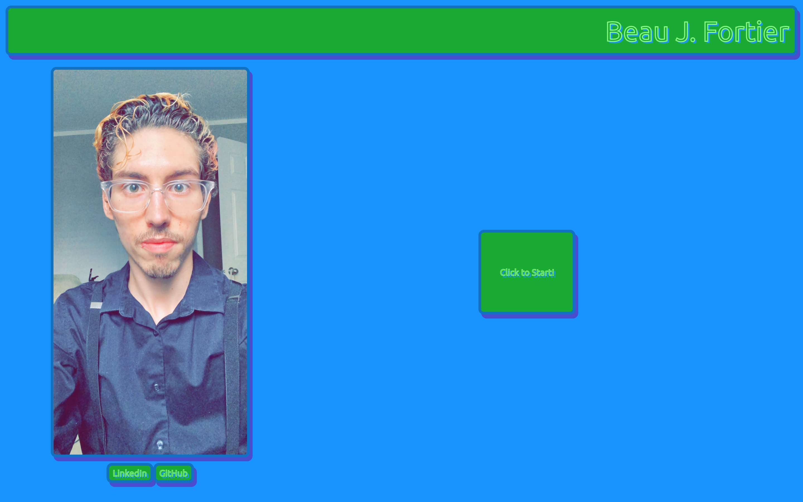
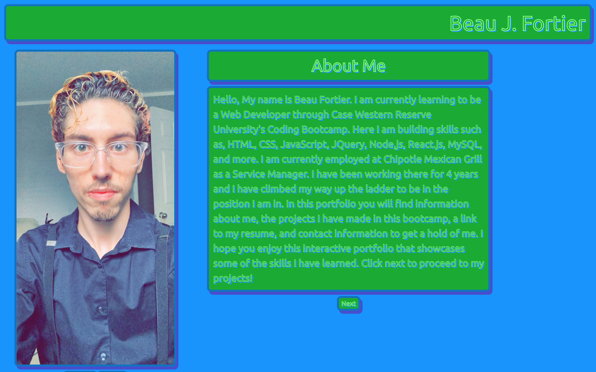
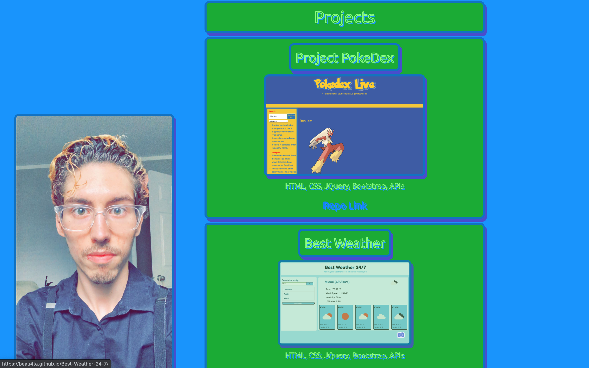

# Portfolio Deluxe
This is another updated version of my Web Development Portfolio. This version is only slightly different from the last one. I updated my old projects and added a new one..

## Purpose
This application is an interactive portfolio made to showcase the 
skills I have built so far in CWRU's Coding Bootcamp. It contains an about me section, a project section, a contact info section, and a resume section. It also contains links to my LinkedIn and GitHub profiles, as well as links to my deployed applications and their repositories.

## Technologies
* VSCode
* HTML
* CSS
* JQuery
* Bootstrap
* APIs
* MySQL
* Sequelize
* Express
* Handlebars

## Links to Deployed Applications
* Project PokeDex - https://ayylam0.github.io/Pokedex-project/
* Employee Scheduler - https://employee-scheduler-project.herokuapp.com/
* Best Weather - https://beau4ta.github.io/Best-Weather-24-7/
* MVC TechBlog - https://radiant-dusk-82859.herokuapp.com/

GitHub: https://github.com/beau4ta/portfolio-deluxe

Live Site: https://beau4ta.github.io/portfolio-deluxe/

GitHub Profile: https://github.com/beau4ta
LinkedIn: https://www.linkedin.com/in/beau-fortier-388058192/
Resume: https://docs.google.com/document/d/17gMRMCYLH5X5xLUvqPVZd0vVnyPHyqlK81p0ww3ilZQ/edit?usp=sharing

Email: beaufortier13@gmail.com
